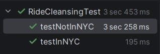
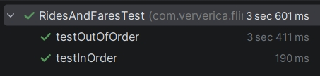
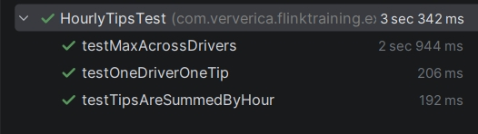
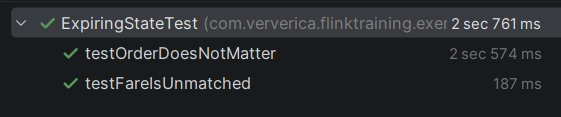

Лабораторная 3. Потоковая обработка в Apache Flink
В этой лабораторной вы будете работать с Apache Flink - фреймворком и движком распределённой обработки потоков данных.

Задание
Выполнить следующие задания из набора заданий репозитория https://github.com/ververica/flink-training-exercises:

RideCleanisingExercise
RidesAndFaresExercise
HourlyTipsExerxise
ExpiringStateExercise

Выполнены на языке Java.

Результаты тестирования:
Тестирование проводилось с помощью JUnit-класса RideCleansingTest.
Все тесты пройдены успешно (зеленый статус).

